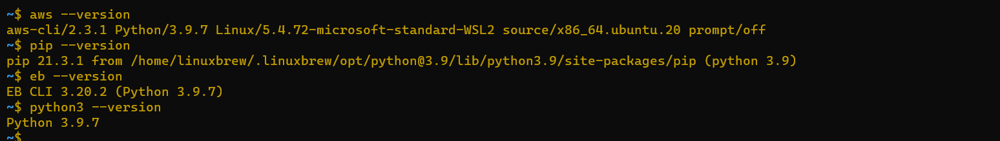
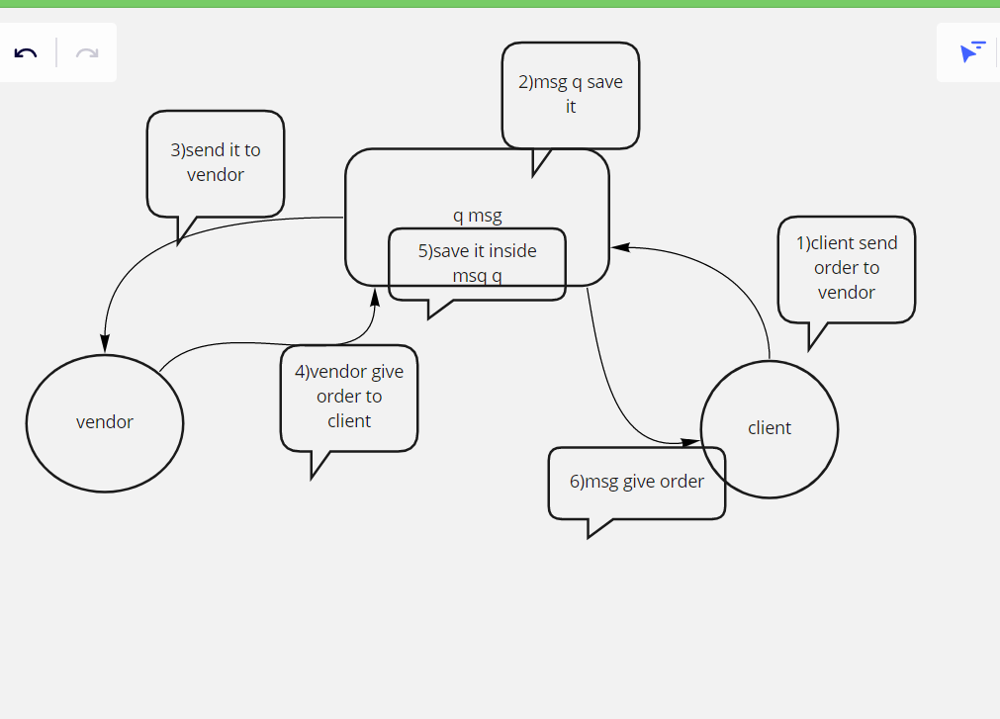
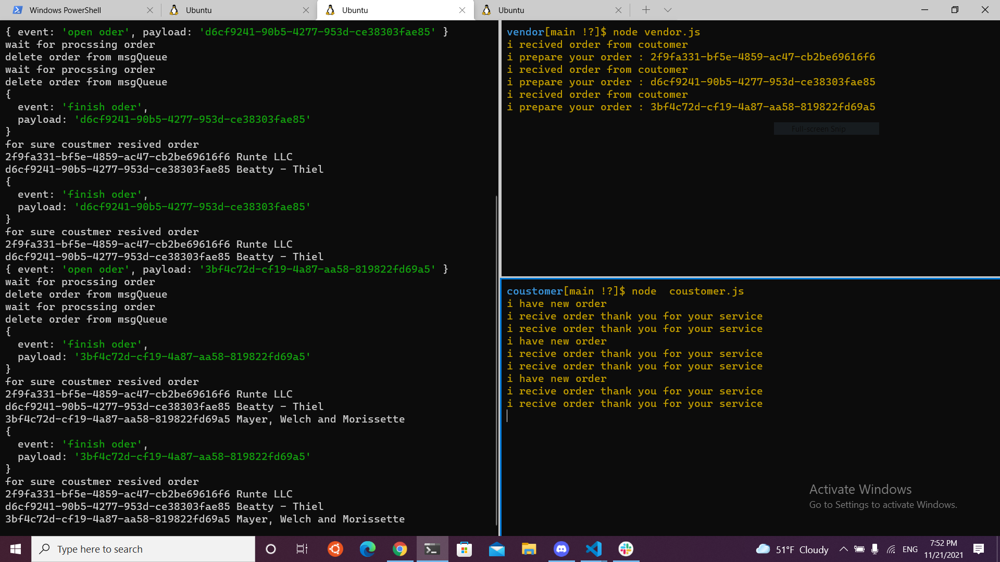

# cloud-server

#### AWS is not free!

Before you begin your work:
Become familiar with the Account/Billing pages.
Setup a cost alert.
Familiarize yourself with how to turn off any services that you create, use, or start.
We highly recommend that you shut off all services at AWS following the completion of this module

### Elastic Beanstalk

Elastic Beanstalk (EB) will automatically wire up essential AWS services to create and deploy a running application.

For Node.js applications, this is generally just going to be an EC2 server instance along with an S3 bucket that stores our files

There are 2 ways to create a new application with EB, detailed below. Either way, all of your environments and applications will be available in the AWS Developer Console (GUI) for you to manage
